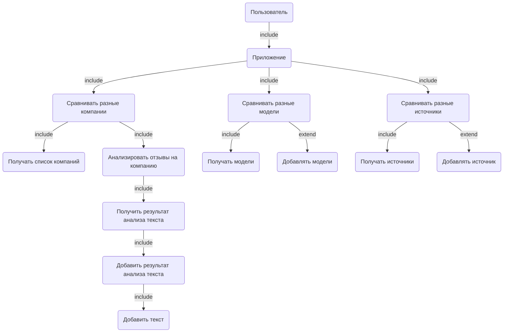
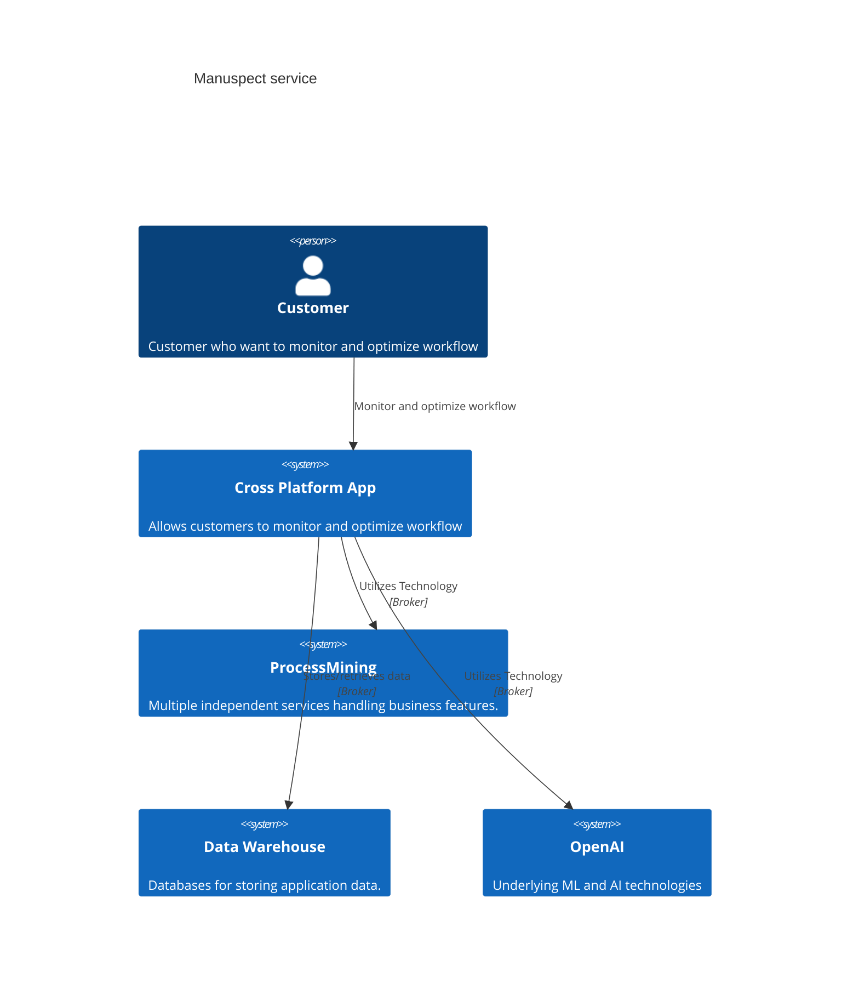
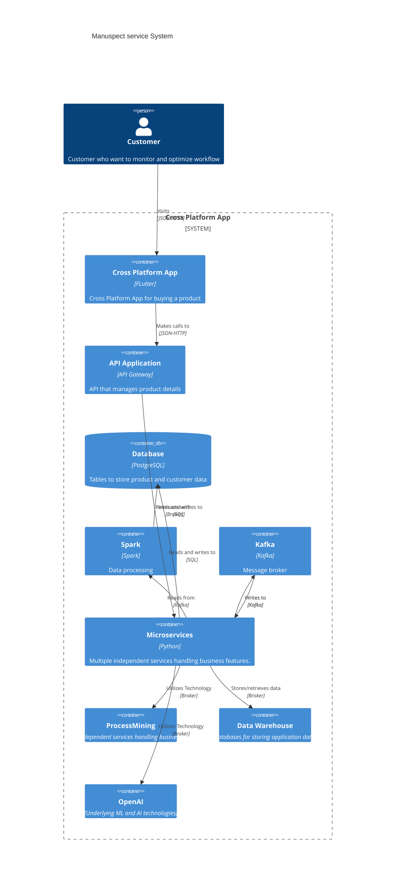
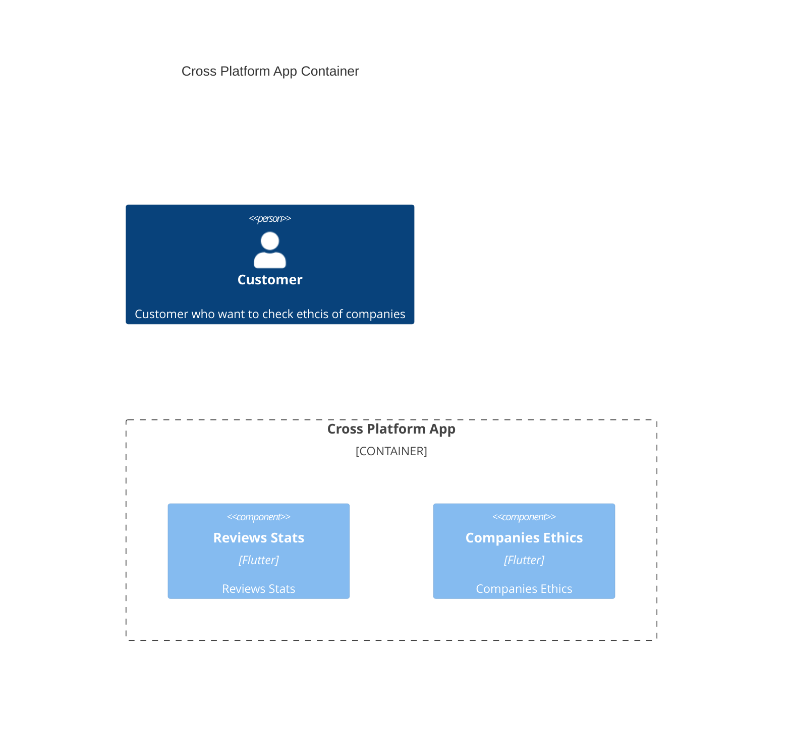

# Manuspect
Виртуальный помощник Manuspect, предназначенный для автоматизации повседневных задач, увеличения эффективности и продуктивности работы, а также оптимизации workflow. Целевая аудитория: фрилансеры, офисные работники, маркетологи, DS специалисты.

Успехом считается работающая модель process mining.

## Use Cases

```mermaid
graph TD
    user("User") -->|include| app("Manuspect App")
    app -->|include| track("Task Tracking")
    track -->|include| define("Define Workflow")
    define -->|include| collectData("Collect Workflow Data")
    define -->|extend| formGraph("Form Workflow Graph")
    define -->|extend| decomposeGraph("Decompose Graph Into Tasks")
    track -->|include| measure("Measure Tasks")
    measure -->|include| assignResources("Assign Resources")
    track -->|include| analyze("Analyze Workflow")
    analyze -->|include| identifyOptimizations("Identify Optimizations")
    analyze -->|extend| planOptimizations("Plan Optimizations")
    analyze -->|include| accumulateResources("Accumulate Resources Statistics")
    
    app -->|include| improve("KPI Improvement")
    improve -->|include| delegate("Delegate Tasks")
    delegate -->|include| automateTasks("Automate Tasks")
    delegate -->|extend| handoverTasks("Hand Over Tasks")
    improve -->|include| improveWorkflow("Improve Workflow Based on AI Recommendations")
    
    app -->|include| control("Automation & KPI Control")
    control -->|include| deploy("Deploy Automations")
    control -->|include| manage("Manage Automations")
    control -->|include| controlKPIs("Control KPIs")
    control -->|extend| displayStats("Display Resource Statistics")
    control -->|extend| controlWorkflow("Control Workflow After Automations")
    controlWorkflow -->|include| interactiveUI("Interactive UI for Automations")

    app -->|include| assistant("Virtual Assistant")
    assistant -->|include| guide("Guide Through Processes")
    assistant -->|extend| recommend("Provide Recommendations")
    assistant -->|extend| analyzeUserFlow("Analyze UserFlow")
    assistant -->|extend| reduceRepetitiveProcesses("Help to Reduce Repetitive Processes")
```

# C4

## Context

## Containers

## Components
