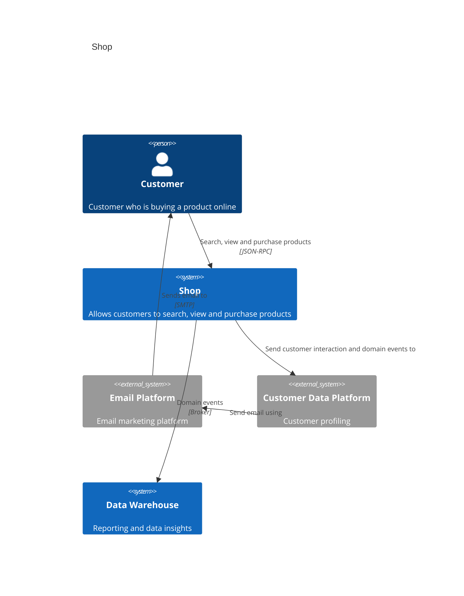
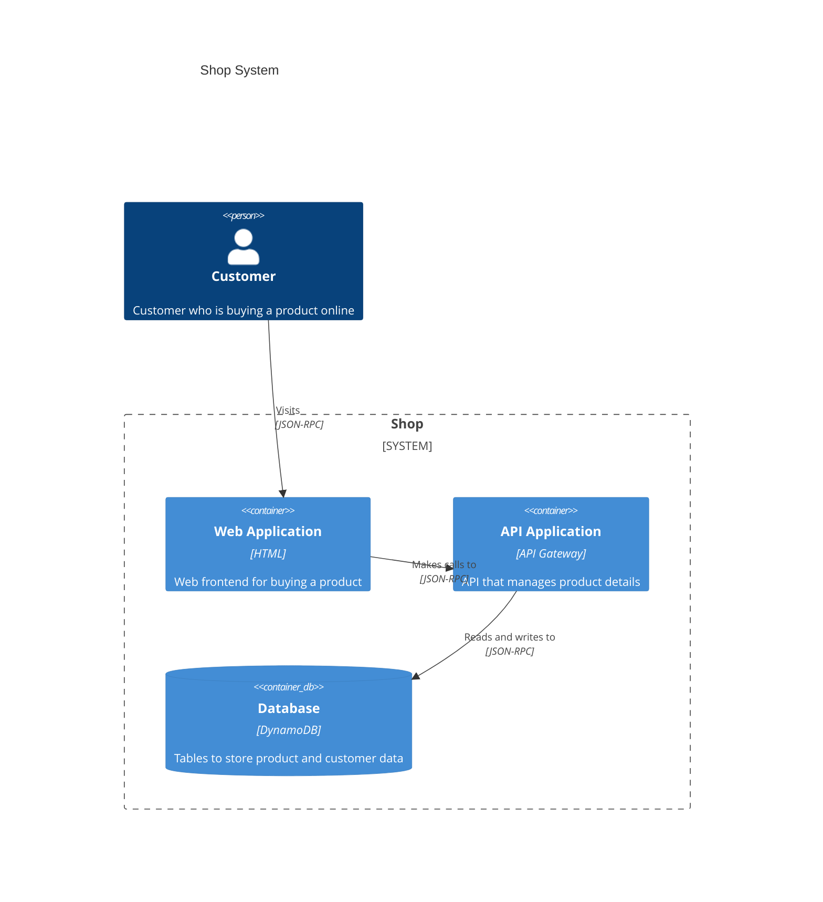
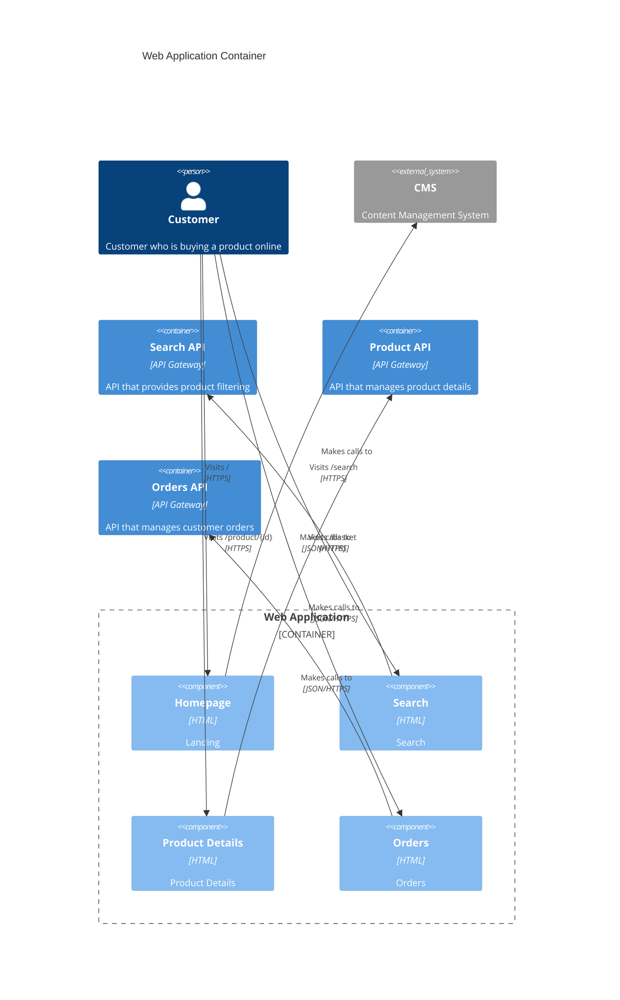
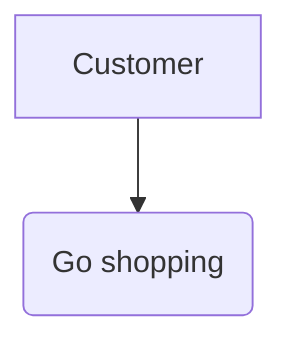
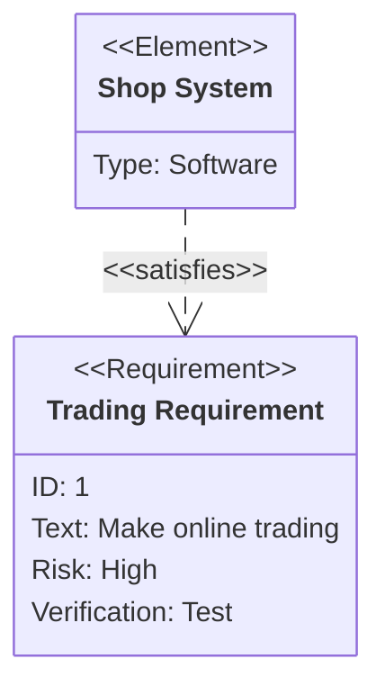

# Анализ этичности компаний на основании отзывов

Система будет собирать отзывы с сайтов, затем на основании отзывов будут ставится оценки компаниям.

# C4

## Context

## Containers

## Components

# UML UC + SysML REQ

## Use Cases

## Requirements

