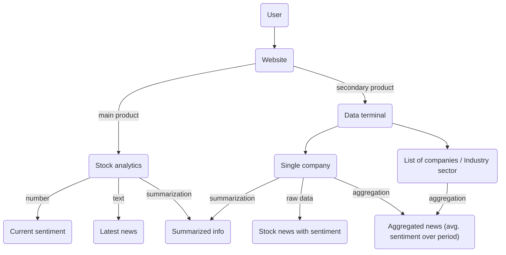
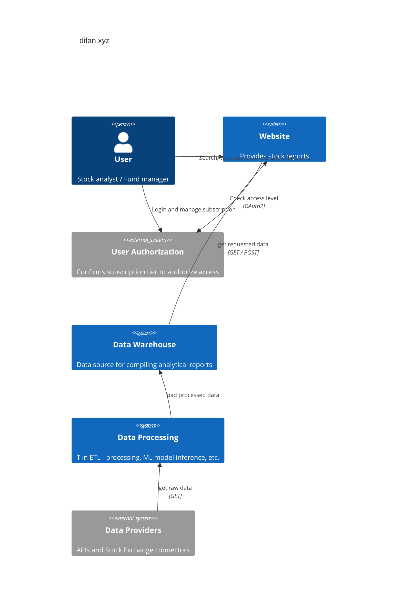
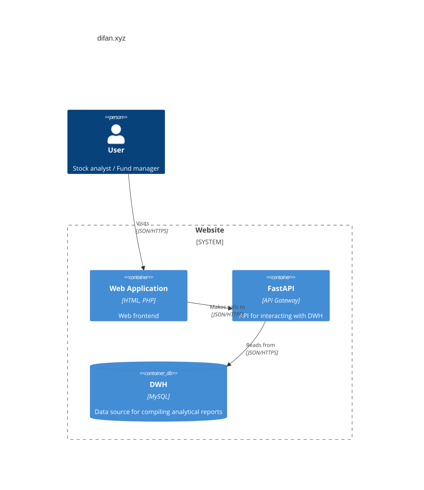
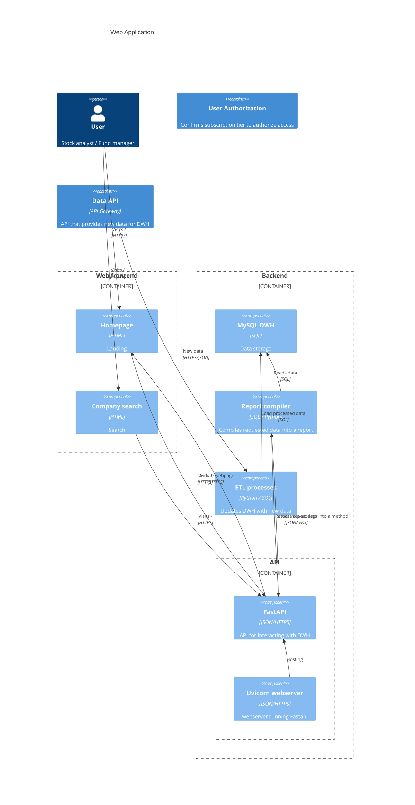

# Анализ сентимента новостей в проекте difan.xyz

Проект является экспериментальной частью стартапа [difan.xyz](https://difan.xyz/).

Планируется интегрировать аналитику новостей по акциям компании в общий аналитический отчет (основной продукт), 
а также предоставлять доступ к данным студентам экономических ВУЗов (дополнительный продукт).

В аналитику новостей пока входит анализ сентимента и различные представления этих данных, суммаризация новостей. 
С точки зрения ML это NLP-задачи классификации и суммаризации текста.

Бизнес-цель: Дополнительная полезная информация, извлекаемая из новостного фона при помощи ML-моделей, 
позволит предоставлять более подробный анализ.

Успехом считается налаженный ETL-пайплайн получения и обработки данных, 
и проработанные endpoint'ы API для вывода результатов на сайт.

## Use Cases

# C4

## Context

## Containers

## Components

