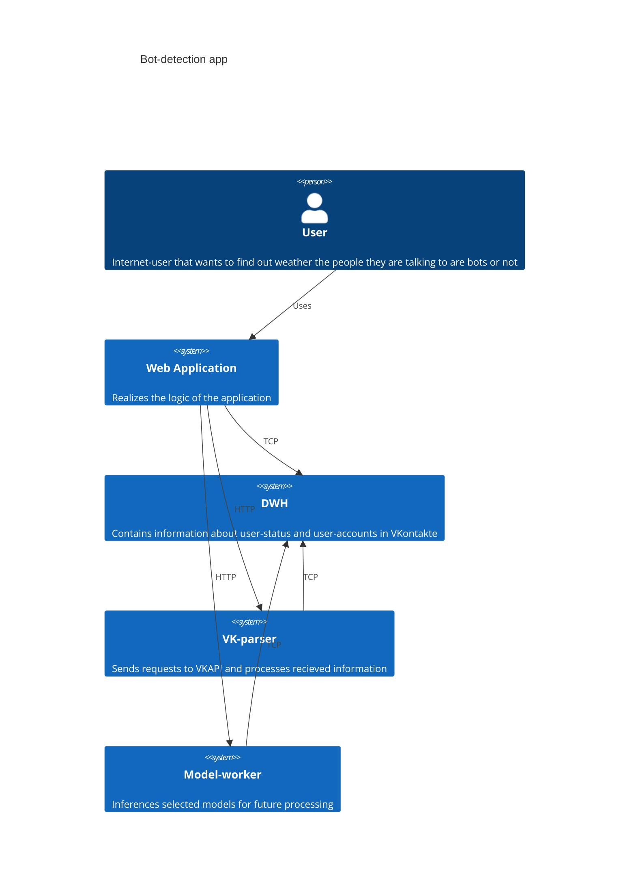
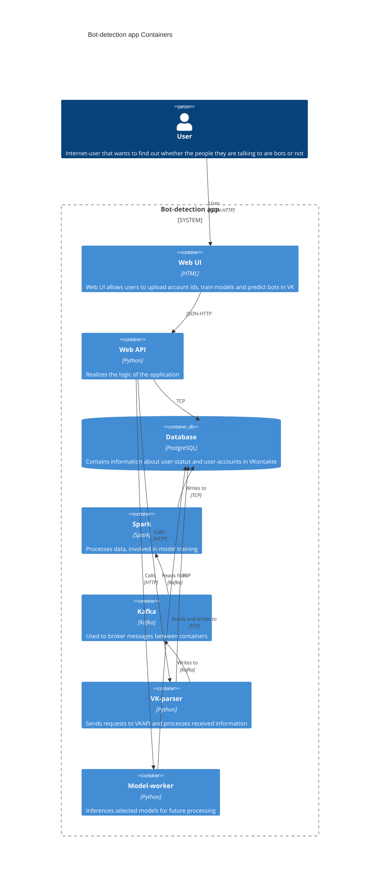
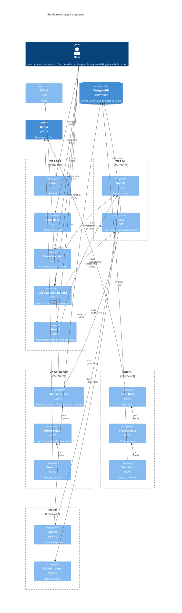
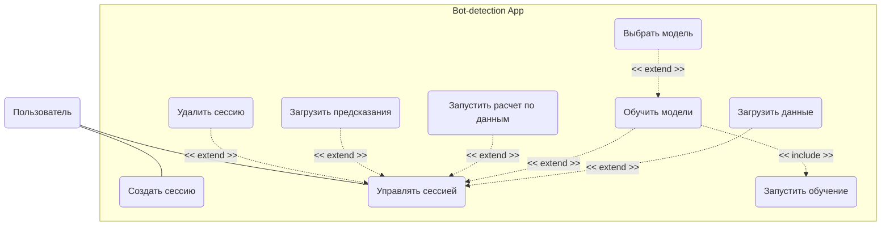

# Bod-detection app for VK

## Context

Система собирает информацию о пользователях из VK-Api, обучает одну из реализованных моделей и предсказывает аккаунты ботов в предоставленном наборе

Бизнес-цель: Уменьшить количество бот-трафика в VK, сделав его более безопасным местом с меньшим количеством политической пропаганды и другой активности.

Успех: Приложение позволяет обнаружить ботов в равном или более чем 80 % случаев.

# C4

<!--  -->

## Containers

<!--  -->

## Components

<!--  -->
## Use Cases

<!--  -->
