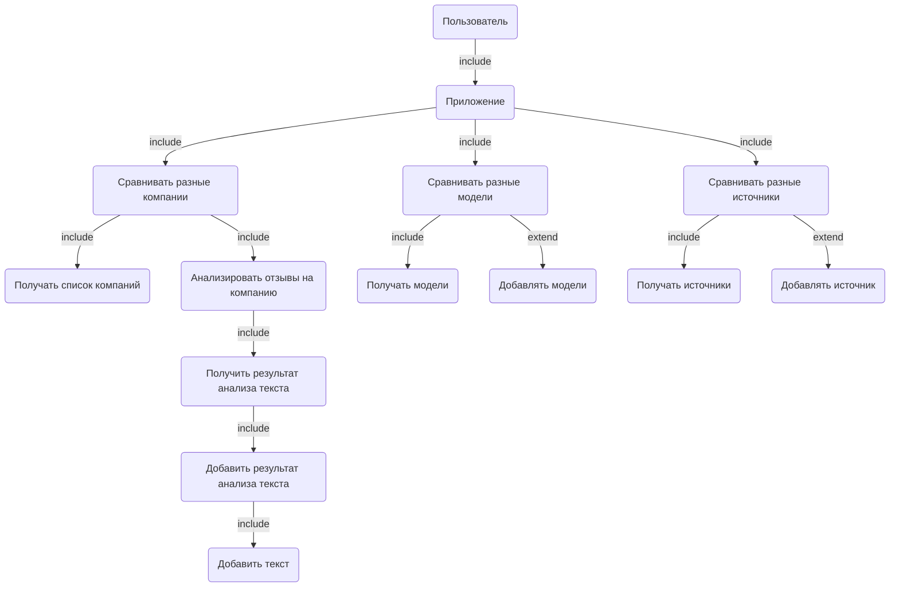
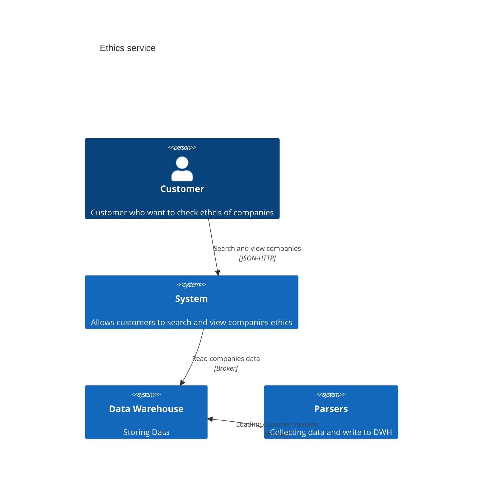
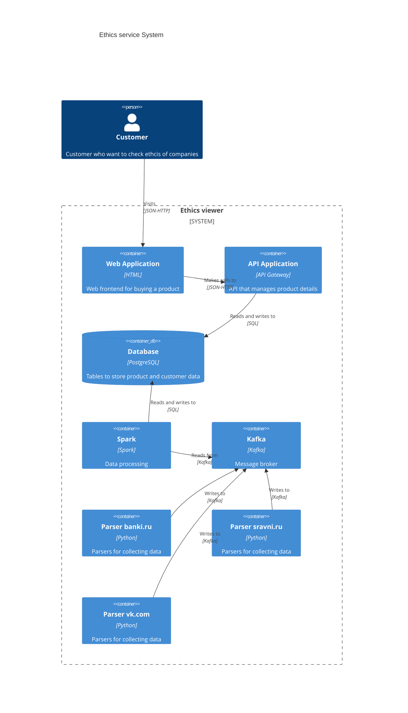

# Анализ этичности компаний на основании отзывов

Система будет собирать отзывы с сайтов, затем на основании отзывов будут ставится оценки компаниям.

Бизнес-цель: Определение этичности компаний поможет улучшить качество сервиса компании. 

ML позволит анализировать отзывы на определение этичнсоти.

Успехом считается работающая модель. 

[Сайт](https://index-ai.ethics.hse.ru)

## Use Cases

# C4

## Context

## Containers

## Components

```mermaid
C4Context
    accTitle: Web Application Container
    accDescr: Components

    Person(person, "Customer", "Customer who want to check ethcis of companies")

    Container_Boundary(webApp, "Web Application", "") {
        Component(reviewsStatsApp, "Reviews Stats", "HTML", "Reviews Stats")
        Component(companiesEthicsApp, "Companies Ethics", "HTML", "Companies Ethics")
    }

    Container_Boundary(api, "API Application", "") {
        Component(getCompanies, "Get Companies", "JSON", "Get Companies")
        Component(getRating, "Get Rating", "JSON", "Get Rating of company")
        Component(getReviews, "Get Reviews statistic", "JSON", "Get Reviews statistic")
    }

    Container_Boundary(parserB, "Parser banki.ru", "") {
        Component(getCompainesB, "Get Companies", "JSON", "Get Companies")
        Component(getReviewsB, "Get Reviews", "JSON", "Get Reviews")
        Component(sendToKafkaB, "Send to Kafka", "JSON", "Send to Kafka")
    }

    Container_Boundary(parserS, "Parser sravni.ru", "") {
        Component(getCompainesS, "Get Companies", "JSON", "Get Companies")
        Component(getReviewsS, "Get Reviews", "JSON", "Get Reviews")
        Component(sendToKafkaS, "Send to Kafka", "JSON", "Send to Kafka")
    }

    Container_Boundary(parserV, "Parser vk.com", "") {
        Component(getCompainesV, "Get Companies", "JSON", "Get Companies")
        Component(getReviewsV, "Get Reviews", "JSON", "Get Reviews")
        Component(sendToKafkaV, "Send to Kafka", "JSON", "Send to Kafka")
    }

    Container_Boundary(spark, "Spark", "") {
        Component(getData, "Get Data", "JSON", "Get Data from Kafka")
        Component(processData, "Process Data", "JSON", "Process Data")
        Component(saveData, "Save Data", "JSON", "Save Data to DB")
        Component(scoreReview, "Score Review", "JSON", "Score Review")
    }

    Component(banki, "Banki.ru API", "JSON", "Banki.ru")
    Component(sravni, "Sravni.ru API", "JSON", "Sravni.ru")
    Component(vk, "Vk.com API", "JSON", "Vk.com")


    ContainerDb(dwh, "Data Warehouse", "PostgreSQL", "Data Warehouse")
    Container(kafka, "Kafka", "Kafka", "Message broker")

    Rel(person, reviewsStatsApp, "Visits /", "HTTPS")
    Rel(person, companiesEthicsApp, "Visits /comparison", "HTTPS")

    Rel(reviewsStatsApp, getReviews, "Makes calls to", "JSON/HTTPS")
    Rel(companiesEthicsApp, getCompanies, "Makes calls to", "JSON/HTTPS")
    Rel(companiesEthicsApp, getRating, "Makes calls to", "JSON/HTTPS")

    Rel(getReviews, dwh, "Reads from", "SQL")
    Rel(getCompanies, dwh, "Reads from", "SQL")
    Rel(getRating, dwh, "Reads from", "SQL")

    Rel(sendToKafkaS, kafka, "Writes to", "SQL")
    Rel(getReviewsS, sravni, "Makes calls to", "JSON/HTTPS")
    Rel(getCompainesS, sravni, "Makes calls to", "JSON/HTTPS")

    Rel(sendToKafkaB, kafka, "Writes to", "SQL")
    Rel(getReviewsB, banki, "Makes calls to", "JSON/HTTPS")
    Rel(getCompainesB, banki, "Makes calls to", "JSON/HTTPS")
    
    Rel(sendToKafkaV, kafka, "Writes to", "SQL")
    Rel(getReviewsV, vk, "Makes calls to", "JSON/HTTPS")
    Rel(getCompainesV, vk, "Makes calls to", "JSON/HTTPS")

    Rel(getData, kafka, "Reads from", "SQL")
    Rel(processData, getData, "Reads from", "SQL")
    Rel(processData, scoreReview, "Writes to", "SQL")
    Rel(scoreReview, saveData, "Writes to", "SQL")
    Rel(saveData, dwh, "Writes to", "SQL")
```

