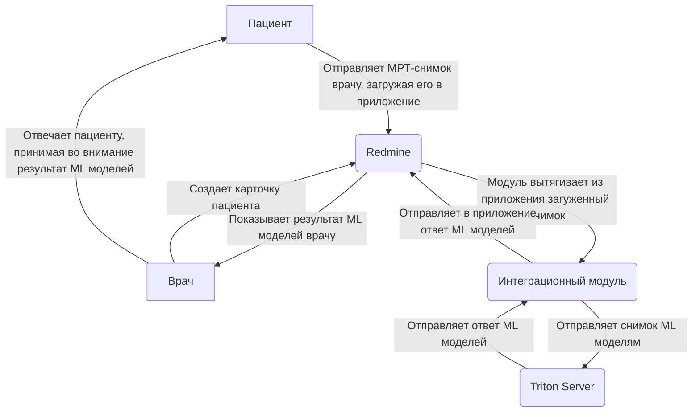
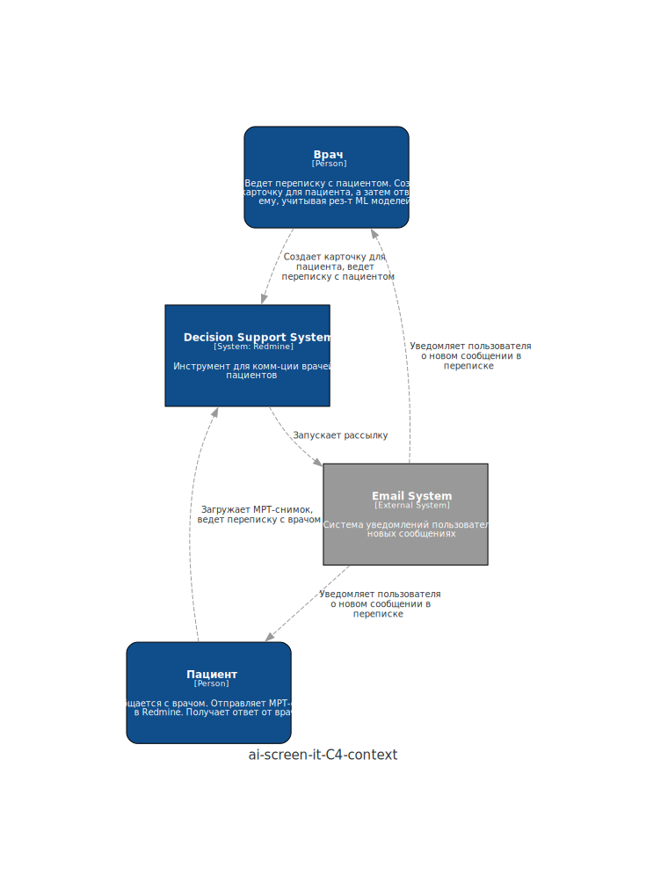
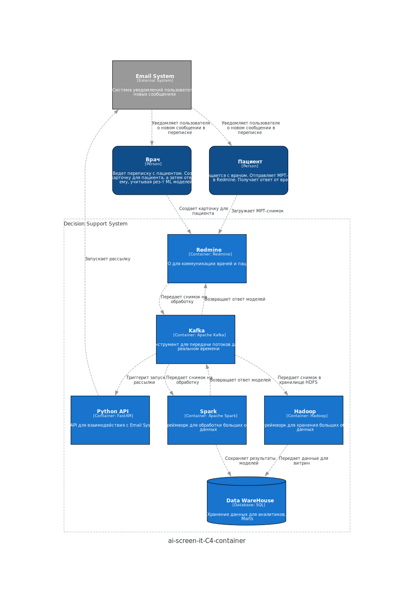
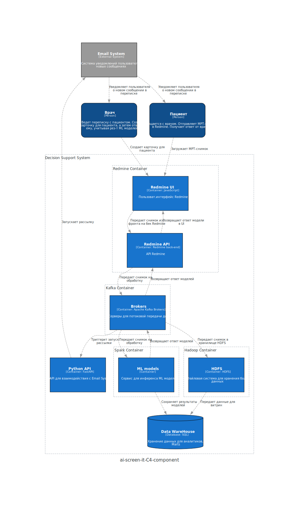

# ai-screen-it

## Описание проекта
- Реально существующий [проект](https://github.com/bs-muu), который реализуется студентами 1 курса AI Talent Hub.
- Основные проблемы, которые решает продукт:
  - Пациенты обращаются в онлайне ко врачам-онкологам за консультацией, отправляя им свои мрт-снимки. Но сейчас не существует инструмент для удобной коммуникации
  - Врачам отправляется множество самых разных снимков, анализ которых требует времени. А в такой сфере, как онкология, важно вовремя отследить динамику изменения опухоли, следовательно нужен инструмент, который бы ускорил процесс анализа снимков и/или отранжировал пациентов по степени риска
- Бизнес-цель – создать инструмент для коммуникации пациентов и врачей-онкологов, в который будут интегрированы нейросети для анализа МРТ-снимков, которые ускорят процесс принятия врачом решения
- К инструменту "прикручиваются" модели классификации и сегментации изображений. Первая определяет, на каких изображениях внутри снимка есть опухоль. Вторая выделяет опухоль и возвращает врачу коллаж с исходным изображением и выделенной опухолью

## Диаграммы

### Use Cases

### C4 Диаграммы

#### Context

#### Containers
Важное уточнение насчет диаграмм контейнеров и компонент:
- Я не понял – задание требует, чтобы мы придумали систему, где есть и Spark и Kafka? Или достаточно одного из этих двух инструментов? Смотря на ту систему, которую я придумал, мне кажется, я мог бы обойтись без Kafka у себя

#### Components
Важные уточнения насчет диаграммы компонент:
- Я генерировал диаграммы с помощью `diagrams.mingrammer`. В нем нет функционала для создания узла типа "Component", есть только "Container"
- В связи с этим на диаграмме компонент у меня нарисованы и подписаны "Container" (библиотека сама подписывает их так), хотя по факту это компоненты

