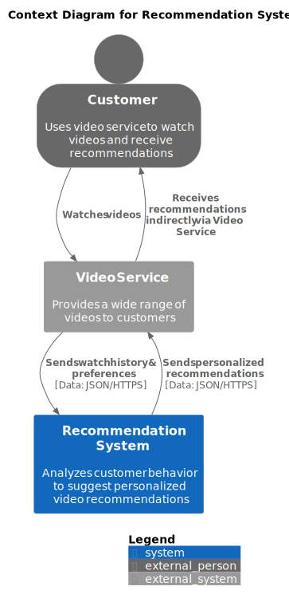

# Сервис рекомендации персонализированной ленты новостей

Сервис должен отдавать список из статей, которые будут учитывать интересы пользователя. Статьи будут собираться из различных новостных источников.

Бизнес-цель: Увеличить вовлеченность пользователей в приложение (глубина чтения статей, количество "мне нравится", продолжительность сессии).

ML позволит определять интересы пользователя и составлять наиболее релевантный список статей.

Успехом считается увеличение метрик относительно baseline решения с рекомендацией популярных статей.

- Масштабирование компонентов `API Application` и `Recommender` не влияет на их взаимодействие с Kafka. В теории можно настроить алгоритм партицирования, чтобы в дальнейшем можно было раздельно обрабатывать partition'ы;
- Масштабирование компонента `Spark` можно сделать таким образом, что каждый отдельный `Spark` instance будет обрабатывать отдельный сервер или шард S3 хранилища.

## Use Cases

# C4

## Context

## Containers

## Components

