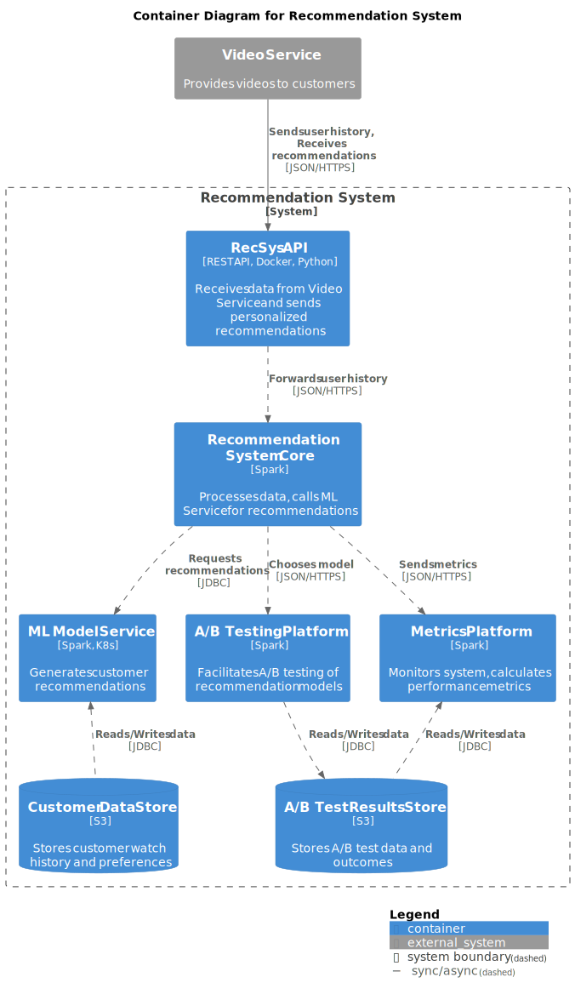

# MorePost

## Задачи проекта:

- **Агрегация данных**: Сбор данных о мероприятиях из социальных сетей VK и Telegram.
- **Обработка данных**: Обработка и анализ собранных данных с использованием Apache Hadoop, Spark и ML моделей.
- **Персонализированный вывод**: Генерация персонализированных дайджестов мероприятий для пользователей.
- **Интерфейсы**: Реализация интерфейсов через REST API, Telegram-бота и мобильное приложение.

## Потребности бизнеса, решаемые задачей:

- Улучшение пользовательского опыта за счет предоставления персонализированных подборок мероприятий, соответствующих интересам пользователей.
- Увеличение привлекательности сервиса и удержание пользователей за счет предоставления актуальной и интересной информации.

## Польза от использования ML:

- **Классификация мероприятий**: Машинное обучение поможет классифицировать мероприятия по различным критериям (например, тематике, местоположению, типу мероприятия), что позволит более точно подбирать мероприятия под интересы пользователя.
- **Суммаризация текста**: Автоматическое краткое изложение содержания мероприятий поможет пользователям быстрее оценить их релевантность.

## Успех выполнения задачи:

- **Увеличение активности пользователей**: Повышение частоты использования сервиса и увеличение продолжительности сеансов.
- **Увеличение удовлетворенности пользователей**: Положительные отзывы, рост конверсии в регистрации на мероприятия.
- **Увеличение доходов**: Увеличение числа пользователей, привлечение рекламодателей и партнеров за счет повышения привлекательности сервиса.
- **Увеличение объема собранных и обработанных данных**: Рост объема данных о мероприятиях, собранных и обработанных системой.

# Mindmap

# C4

## Context

## Containers

## Components

