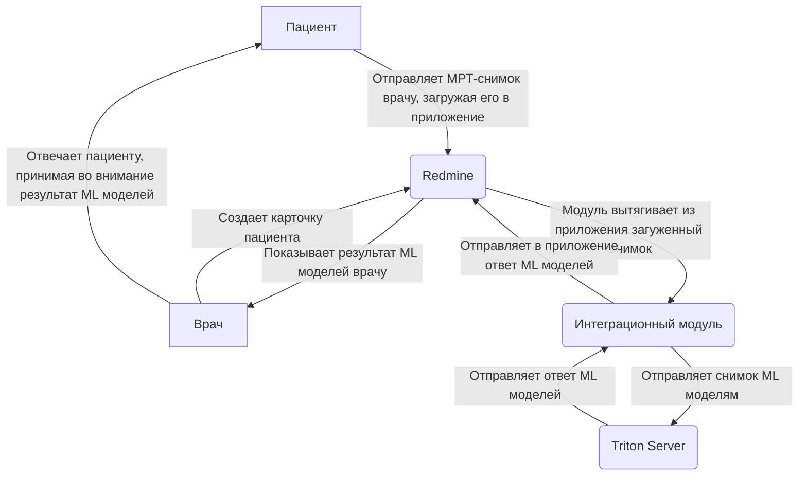

```mermaid
graph
    patient[Пациент] -->|Отправляет МРТ-снимок врачу, загружая его в приложение| app(Redmine)
    doctor[Врач] -->|Создает карточку пациента| app(Redmine)

    app(Redmine) -->|Показывает результат ML моделей врачу| doctor[Врач]
    doctor[Врач] -->|Отвечает пациенту, принимая во внимание результат ML моделей| patient[Пациент]

    app -->|Модуль вытягивает из приложения загуженный снимок| module(Интеграционный модуль)
    module -->|Отправляет в приложение\nответ ML моделей| app

    module -->|Отправляет снимок ML моделям| mlmodels(Triton Server)
    mlmodels -->|Отправляет ответ ML моделей| module

```
